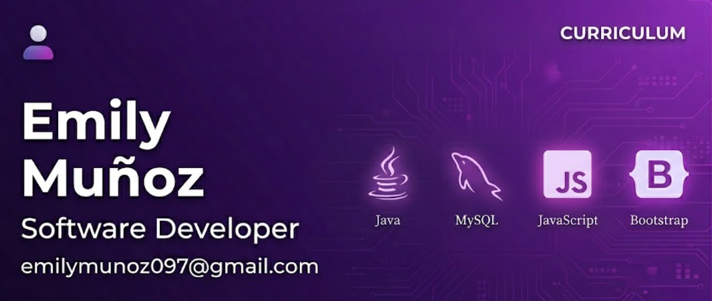

# Hi, I'm Emily Muñoz! 👋

  

### 👩‍💻 Software Development Student | B2 English Level | Future ADSO Technologist

"I am a Software Analysis and Development student (5th semester) currently expanding my technical foundations in the Java ecosystem and web technologies. I define myself as a patient and empathetic professional, which allows me to understand user needs and collaborate effectively through assertive communication. 

My greatest strength is my persistence; I am highly resilient when facing technical challenges or learning new complex concepts, always maintaining a focus on continuous improvement and giving my absolute best to grow as a developer. With a B2 English level and a strong problem-solving mindset, I am eager to secure a professional internship where I can contribute my values and continue strengthening my technical skills."

---

### 📝 About Me
* 🔭 **Focus:** Object-Oriented Programming (OOP), database design, and agile methodologies.
* 🎓 **Education:** Currently finishing my Technologist degree in Software Analysis and Development (ADSO).
* 🚀 **Goal:** Seeking my first professional internship to apply my technical knowledge in a real-world environment.
* 💬 **Languages:** Spanish (Native) | **English (B2 - Upper Intermediate)**.

---

### 🛠️ Technical Toolbox

| Category | Skills & Tools |
| :--- | :--- |
| **Programming** |   |
| **Frontend** |    |
| **Backend & DB** |   |
| **Tools & Others** |     |

---

### 🎓 Education & Certifications
* **Technologist in Software Analysis and Development** - SENA (In Progress - 5th Semester).
* **Systems technician** - SENA 
* **JavaScript Essentials 1** - Cisco Networking Academy.
* **CSS Essentials** - Cisco Networking Academy.
* **HTML Essentials** - Cisco Networking Academy.

---

### 📫 Contact with me !
- **Email:** emilymunoz097@gmail.com
- **Location:** Bogotá, Colombia 📍
